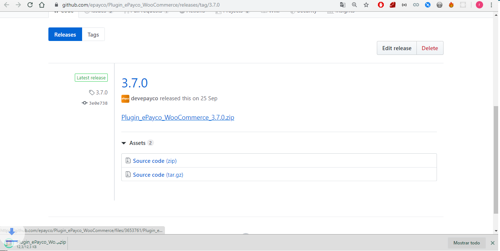
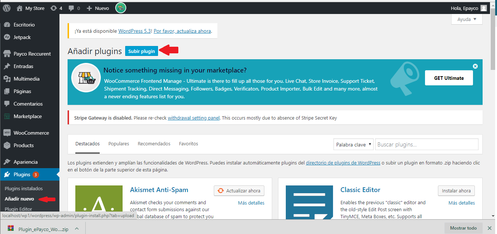
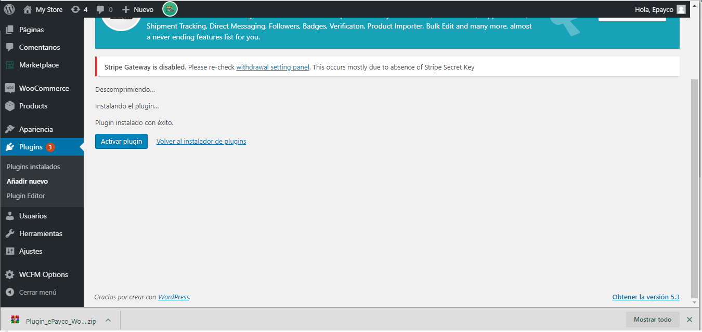
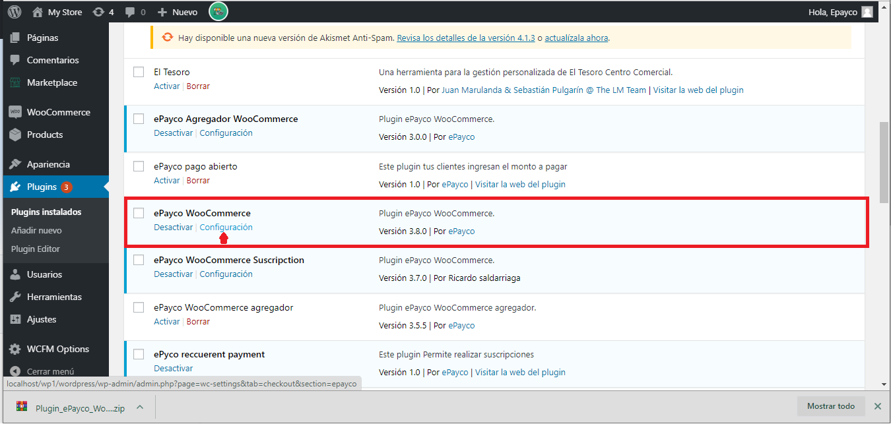
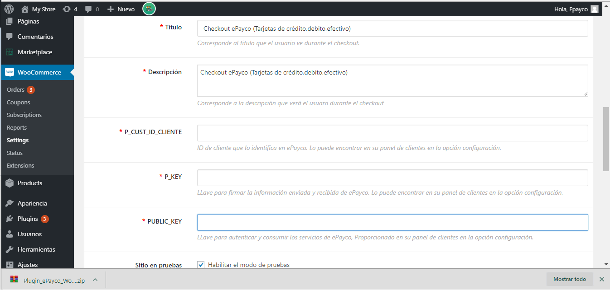
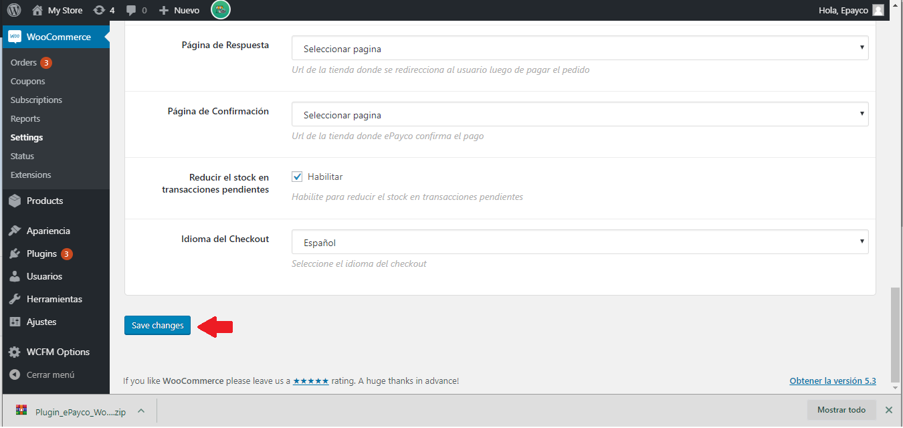
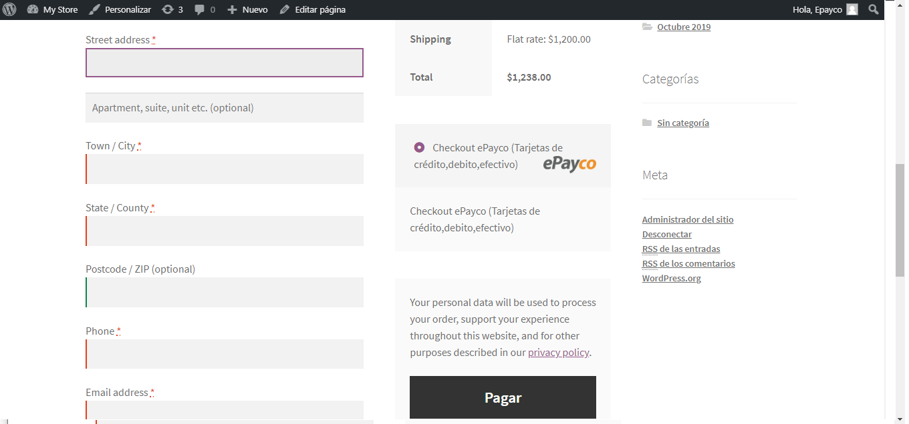
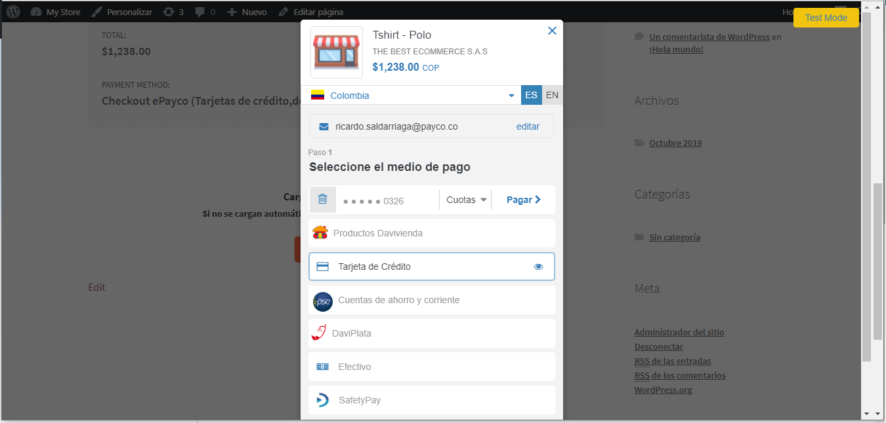

#ePayco plugin para WooCommerce v2.6

**Si usted tiene alguna pregunta o problema, no dude en ponerse en contacto con nuestro soporte técnico: desarrollo@payco.co.**

## Versiones
* [ePayco plugin WooCommerce v4.3.x](https://github.com/epayco/Plugin_ePayco_WooCommerce/releases/tag/V4.3.x).
* [ePayco plugin WooCommerce v4.2.x](https://github.com/epayco/Plugin_ePayco_WooCommerce/releases/tag/V4.2.x).
* [ePayco plugin WooCommerce v4.0.x](https://github.com/epayco/Plugin_ePayco_WooCommerce/releases/tag/V4.0.x).
* [ePayco plugin WooCommerce v3.9.x](https://github.com/epayco/Plugin_ePayco_WooCommerce/releases/tag/v3.9.x).
* [ePayco plugin WooCommerce v3.8.x](https://github.com/epayco/Plugin_ePayco_WooCommerce/releases/tag/3.8.x).
* [ePayco plugin WooCommerce v3.7.x](https://github.com/epayco/Plugin_ePayco_WooCommerce/releases/tag/3.7.0).
* [ePayco plugin WooCommerce v3.6.x](https://github.com/epayco/Plugin_ePayco_WooCommerce/releases/tag/3.6.5).
* [ePayco plugin WooCommerce v3.5.x](https://github.com/epayco/Plugin_ePayco_WooCommerce/releases/tag/3.5.3).
* [ePayco plugin WooCommerce v3.4.x](https://github.com/epayco/Plugin_ePayco_WooCommerce/releases/tag/3.4.2).
* [ePayco plugin WooCommerce v3.2.x](https://github.com/epayco/Plugin_ePayco_WooCommerce/releases/tag/3.2.1).
* [ePayco plugin WooCommerce v3.0.4.x](https://github.com/epayco/Plugin_ePayco_WooCommerce/releases/tag/3.0.4.x).
* [ePayco plugin WooCommerce v2.6.4.x](https://github.com/epayco/Plugin_ePayco_WooCommerce/releases/tag/2.6.4.x).
* [ePayco plugin WooCommerce v2.6](https://github.com/epayco/Plugin_ePayco_WooCommerce/releases/tag/2.6).

## Tabla de contenido

* [Requisitos](#requisitos)
* [Instalación](#instalación)
* [Pasos](#pasos)
* [Versiones](#versiones)

## Requisitos

* Tener una cuenta activa en [ePayco](https://pagaycobra.com).
* Tener instalado WordPress y WooCommerce.
* Acceso a las carpetas donde se encuetra instalado WordPress y WooCommerce.
* Acceso al admin de WordPress.

## Instalación

1. [Descarga el plugin.](https://github.com/epayco/Plugin_ePayco_WooCommerce/releases/tag/3.2.1)
2. Ingresa al administrador de tu wordPress.
3. Ingresa a Plugins / Añadir-Nuevo / Subir-Plugin. 
4. Busca el plugin descargado en tu equipo y súbelo como cualquier otro archivo.
5. Después de instalar el .zip lo puedes ver en la lista de plugins instalados , puedes activarlo o desactivarlo.
6. Para configurar el plugin debes ir a: WooCommerce / Ajustes / Finalizar Compra y Ubica la pestaña ePayco.
7. Configura el plugin ingresando el **P_CUST_ID_CLIENTE** y el **P_KEY**, los puedes ver en tu [panel de clientes](https://secure.payco.co/clientes/).
8. Selecciona o crea una página de respuesta donde el usuario será devuelto después de finalizar la compra.
9. Realiza una o varias compras para comprobar que todo esté bien.
10. Si todo está bien recuerda cambiar la variable Modo Prueba a NO y empieza a recibir pagos de forma instantánea y segura con ePayco.

## Pasos

