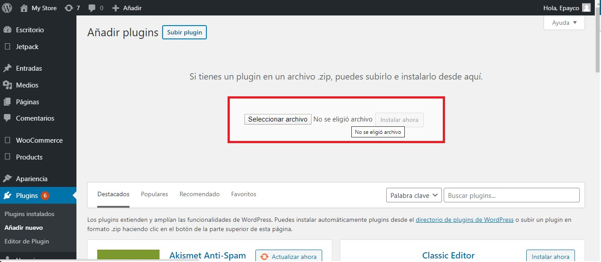
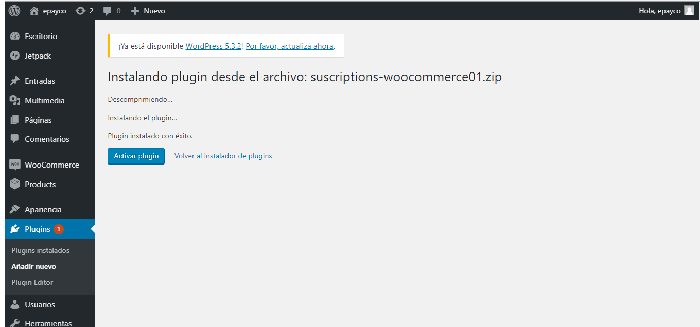
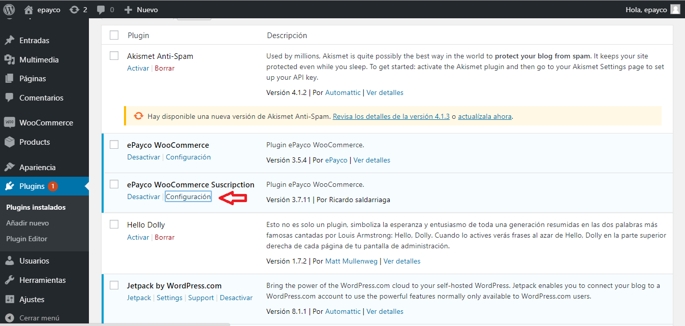
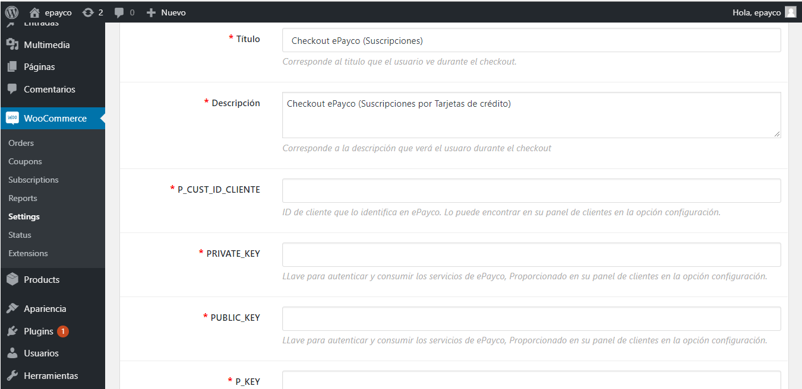
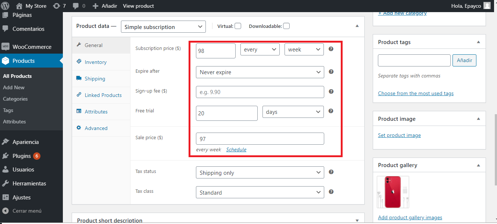

#ePayco plugin para WooCommerce v2.6

**Si usted tiene alguna pregunta o problema, no dude en ponerse en contacto con nuestro soporte técnico: desarrollo@payco.co.**

## Tabla de contenido

* [Requisitos](#requisitos)
* [Instalación](#instalación)
* [Configuración](#configuración)
* [Pasos](#pasos)
* [Versiones](#versiones)

## Requisitos

* Tener una cuenta activa en [ePayco](https://pagaycobra.com).
* Tener instalado WordPress y WooCommerce.
* Acceso a las carpetas donde se encuetra instalado WordPress y WooCommerce.
* Acceso al admin de WordPress.

## Instalación

1. [Descarga el plugin.](https://github.com/epayco/Plugin_ePayco_WooCommerce/releases/tag/2.6)

## Pasos

## Versiones
* [ePayco plugin WooCommerce v2.6](https://github.com/epayco/Plugin_ePayco_WooCommerce/releases/tag/2.6).
